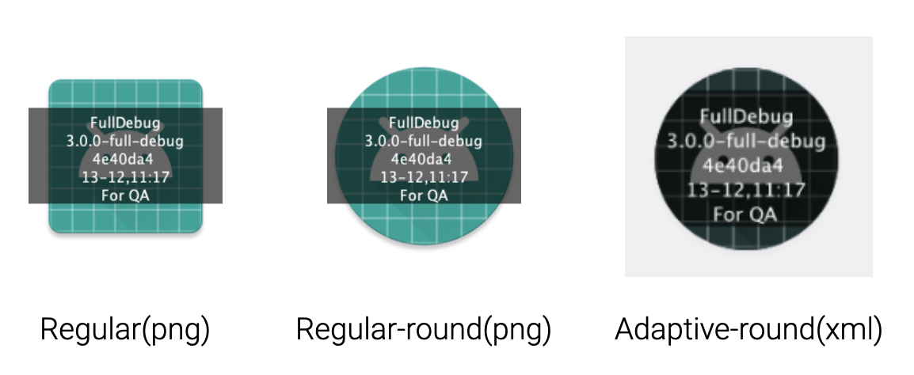

[](https://search.maven.org/artifact/me.2bab/scratchpaper) 
[](https://github.com/2bab/ScratchPaper/actions) 
[](https://www.apache.org/licenses/LICENSE-2.0)

[English][[中文说明]](./README_zh.md)

ScratchPaper is a Gradle Plugin helps distinguish the variant/version/git-commit-id by adding a launcher icon overlay, powered by [New Variant/Artifact API](https://developer.android.com/studio/build/extend-agp) & [Polyfill](https://github.com/2BAB/Polyfill). Accepted by [Google Dev Library](https://devlibrary.withgoogle.com/products/android/repos/2BAB-ScratchPaper).


## How does it work?



> If you install both debug&release Apps on one device, you can not distinguish which one you is your target for testing.

> If you have more than one staging Apps for QAs, when they found some issues you may don't know how to match the App version to your code base (branch/commit/etc..), because all of them share the same version like "2.1.0-SNAPSHOT".

ScratchPaper can add an overlay on your launcher icon, and put given information on it.

- Support regular & round Icons 
- Support adaptive-icon
- Support AAPT2
- Support custom text of multiple lines with some built-in content

In addition, the plugin can be enabled/disabled for per variant respectively.


## Why choose ScratchPaper?

We can find some similar solutions from Github, but the pain points of them are: most of them do not support latest AAPT2/AGP. ScratchPaper supports latest AAPT2/AGP, adaptive icons, and use new Variant API / Gradle lazy properties to gain a better performance. Apart from that, [usefulness/easylauncher-gradle-plugin](https://github.com/usefulness/easylauncher-gradle-plugin) is one of the most popular solution that is still under maintained, it supports fancy filters and additional pngs to add on badges. If you don't need multiple lines text, that is a great choice as well.


## Usage

**0x01. Add the plugin to classpath:**

```gradle
// Option 1.
// Add `mavenCentral` to `pluginManagement{}` on `settings.gradle.kts` (or the root `build.gradle.kts`),
// and scratchpaper plugin id.
pluginManagement {
	repositories {
        ...
        mavenCentral()
    }
    plugins {
    	...
    	id("me.2bab.scratchpaper") version "3.2.0" apply false
    }
}


// Option 2.
// Using classic `buildscript{}` block in root build.gradle.kts.
buildscript {
    repositories {
        ...
        mavenCentral()
    }
    dependencies {
    	...
        classpath("me.2bab:scratchpaper:3.2.0")
    }
}
```


**0x02. Apply Plugin:**

``` gradle
// On Application's build.gradle.kts (do not use in Library project)
plugin {
    ...
    id("me.2bab.scratchpaper")
}
```

**0x03. Advanced Configurations**

``` kotlin
scratchPaper {
    // Main feature flags. Mandatory field.
    // Can not be lazily set, it's valid only before "afterEvaluate{}".
    // In this way, only "FullDebug" variant will get icon overlays
    enableByVariant { variant ->
        variant.name.contains("debug", true)
                && variant.name.contains("full", true)
    }

    // Mandatory field.
    // Can be lazily set even after configuration phrase.
    iconNames.set("ic_launcher, ic_launcher_round")

    // Some sub-feature flags
    enableXmlIconsRemoval.set(false) // Can be lazily set even after configuration phrase.
    forceUpdateIcons = true // Can not be lazily set, it's valid only before "afterEvaluate{}".

    // ICON_OVERLAY styles, contents.
    style {
        textSize.set(9)
        textColor.set("#FFFFFFFF") // Accepts 3 kinds of format: "FFF", "FFFFFF", "FFFFFFFF".
        lineSpace.set(4)
        backgroundColor.set("#99000000") // Same as textColor.
    }

    content {
        showVersionName.set(true)
        showVariantName.set(true)
        showGitShortId.set(true)
        showDateTime.set(true)
        extraInfo.set("For QA")
    }
}
```

**0x04. Build your App and Enjoy!**

Check screenshots on the top.


## Compatible

ScratchPaper is only supported & tested on LATEST ONE Minor versions of Android Gradle Plugin. Since `2.5.4`, the publish repository has been shifted from Jcenter to **Maven Central**.

AGP Version|Latest Support Version
-----------|-----------------
7.2.x | [](https://search.maven.org/artifact/me.2bab/scratchpaper)
7.1.x | [](https://search.maven.org/artifact/me.2bab/scratchpaper)
7.0.x | 3.0.0
4.2.x | 2.6.0
4.1.x | 2.5.4
4.0.x | 2.5.3
3.6.x | 2.5.1
3.5.x | 2.4.2
3.4.x | 2.4.1
3.3.x | 2.4.1
3.2.x | 2.4.0
3.1.x | 2.4.0
3.0.x (Aapt2) | Support
2.3.x (Aapt2) | Never Tested
2.3.x (Aapt1) | Not Support


## Git Commit Check

Check this [link](https://medium.com/walmartlabs/check-out-these-5-git-tips-before-your-next-commit-c1c7a5ae34d1) to make sure everyone will make a **meaningful** commit message.

So far we haven't added any hook tool, but follow the regex below:

```
(chore|feat|docs|fix|refactor|style|test|hack|release)(:)( )(.{0,80})
```


## v1.x (Deprecated)

The v1.x `IconCover` forked from [icon-version@akonior](https://github.com/akonior/icon-version). It provided icon editor functions that compatible with `Aapt1`, and I added some little enhancement like hex color support, custom text support. As time goes by, we have to move to `Aapt2` sooner or later. So I decide to revamp the whole project and add more fancy features. **If you are still using `Aapt1` with `IconCover`, now is the time to consider moving into the new one.**


## License

>
> Copyright 2016-2022 2BAB
>
>Licensed under the Apache License, Version 2.0 (the "License");
you may not use this file except in compliance with the License.
You may obtain a copy of the License at
>
>   http://www.apache.org/licenses/LICENSE-2.0
>
> Unless required by applicable law or agreed to in writing, software
distributed under the License is distributed on an "AS IS" BASIS,
WITHOUT WARRANTIES OR CONDITIONS OF ANY KIND, either express or implied.
See the License for the specific language governing permissions and
limitations under the License.

