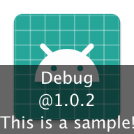
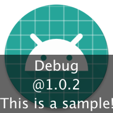
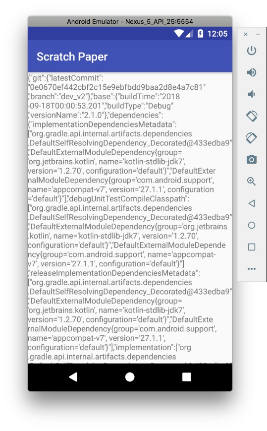

# ScratchPaper (v2)

[](https://bintray.com/2bab/maven/scratch-paper/_latestVersion) [](https://www.apache.org/licenses/LICENSE-2.0) [](https://github.com/2BAB/ScratchPaper/pulls)

[中文说明][[English]](./README.md)

## ScratchPaper 做了些什么？





> 如果你在一台设备上同时安装一个 App 的 Debug 版和 Release 版，你可能很难区分出来到底哪个你要测试的版本（不打开的情况下）。

ScratchPaper 可以在你的 App icon 上加一个蒙层用以区分出各个 BuildType 的 App，并且承载了版本信息等附加文字。

- 支持 常规 和 圆形 的图标
- 支持 adaptive-icon
- 支持 AAPT2

> 如果你同时打了多个测试包给测试或者产品（例如基于多个复合分支），当他们给你反馈的问题时候你和他们可能都很难分别出每个 App 对应的具体的分支或者 commit 节点。

ScratchPaper 支持生成编译信息并打包到你的 Apk 中（从 assets 中读取），以及输出一份拷贝到 `/intermedias/scratch-paper/assets` 文件夹，包括：

- Base: Build Time, Build Type, etc.
- Git: Latest Commit ID & commit branch, etc.
- Dependencies
- ...

## 为什么一定要试试 ScratchPaper

其实市面上不乏有类似的解决方案，例如：akonior/icon-version, akaita/easylauncher-gradle-plugin。但是他们的最重要问题在于：不支持 AAPT2！由于 Google 在 18 年底停止了对 aapt1 的支持（enableAapt2=false 将被移除），所以尽早迁移到 AAPT2 其实是一个明智的选择。最后 AAPT2 还会带来额外的诸多好处：

- 其实对 local debug build 时的性能是有一定提升的
- 修复很多 AAPT1 的低级 Bug （我曾写过一个插件来修复各类 AAPT 处理 Manifest 时的 Bug，具体查阅 https://github.com/2BAB/Seal）
- 同样有办法支持插件化的开发

## 如何使用？

**0x01. Add the plugin to classpath:**

``` gradle
buildscript {
    repositories {
        jcenter()
    }
    dependencies {
        classpath 'com.android.tools.build:gradle:4.0.0'
        classpath 'me.2bab:scratch-paper:2.5.2'
    }
}
```

**0x02. Apply Plugin:**

``` gradle
// On Application's build.gradle (do not use in Library project)
apply plugin: 'me.2bab.scratchpaper'
```


**0x03. Advanced Configurations**

``` gradle
scratchPaper {
    textSize = 10
    textColor = "#FFFFFFFF"
    verticalLinePadding = 4
    backgroundColor = "#99000000"
    extraInfo = new Date().format("MM-dd,HH:mm")
    enableGenerateIconOverlay = true
    enableGenerateBuildInfo = true
    enableVersionNameSuffixDisplay = true

    // Experimental field
    // @see IconOverlayGenerator#removeXmlIconFiles
    enableXmlIconRemove = false
}
```

**0x04. Build your App and Enjoy!**

效果请看头部的截图。

## 兼容性

精力有限，ScratchPaper 只会支持最新一个 Minor 版本的 Android Gradle Plugin（例如最新版是 3.3.3, 那一般地 3.3.x 都会支持）：

AGP Version|Compatible Status
-----------|-----------------
4.0.0 (Aapt2) | Support (2.5.2+)
3.6.x (Aapt2) | Support (last support version - 2.5.1)
3.5.x (Aapt2) | Support (last support version - 2.4.2)
3.4.x (Aapt2) | Support (last support version - 2.4.1)
3.3.x (Aapt2) | Support (last support version - 2.4.1)
3.2.x (Aapt2) | Support (last support version - 2.4.0)
3.1.x (Aapt2) | Support (last support version - 2.4.0)
3.0.x (Aapt2) | Support
2.3.x (Aapt2) | Never Tested
2.3.x (Aapt1) | Not Support

## Git Commit Check

Check this [link](https://medium.com/walmartlabs/check-out-these-5-git-tips-before-your-next-commit-c1c7a5ae34d1) to make sure everyone will make a **meaningful** commit message.

So far we haven't added any hook tool, but follow the regex below:

```
(chore|feat|docs|fix|refactor|style|test|hack|release)(:)( )(.{0,80})
```


## v1.x (Deprecated)

The v1.x `IconCover` forked from [icon-version@akonior](https://github.com/akonior/icon-version). It provided icon editor functions that compatible with `Aapt1`, and I added some little enhancement like hex color support, custom text support. As time goes by, we have to move to `Aapt2` sooner or later. So I decide to revamp the whole project and add more fancy features. **If you are still using `Aapt1` with `IconCover`, now is the time to consider moving into the new one.**

## License

>
> Copyright 2016-2020 2BAB
>
>Licensed under the Apache License, Version 2.0 (the "License");
you may not use this file except in compliance with the License.
You may obtain a copy of the License at
>
>   http://www.apache.org/licenses/LICENSE-2.0
>
> Unless required by applicable law or agreed to in writing, software
distributed under the License is distributed on an "AS IS" BASIS,
WITHOUT WARRANTIES OR CONDITIONS OF ANY KIND, either express or implied.
See the License for the specific language governing permissions and
limitations under the License.

